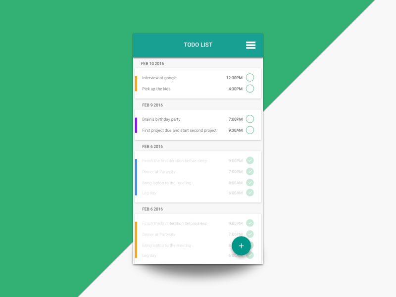

# Interface de Usuario 1

### Descripcion de la tarea

Los elementos que no son necesarios son los siguientes:

- FloatingButton
- Linea de color a la izquierda
- Toolbar (hare ejemplos en la proxima clase)

Detalles adicionales

- En el radiobutton no es necesario que sea un "check" pero si que tenga ese color

Cualquier duda o consulta a mi correo: pxhcastr@cibertec.edu.pe